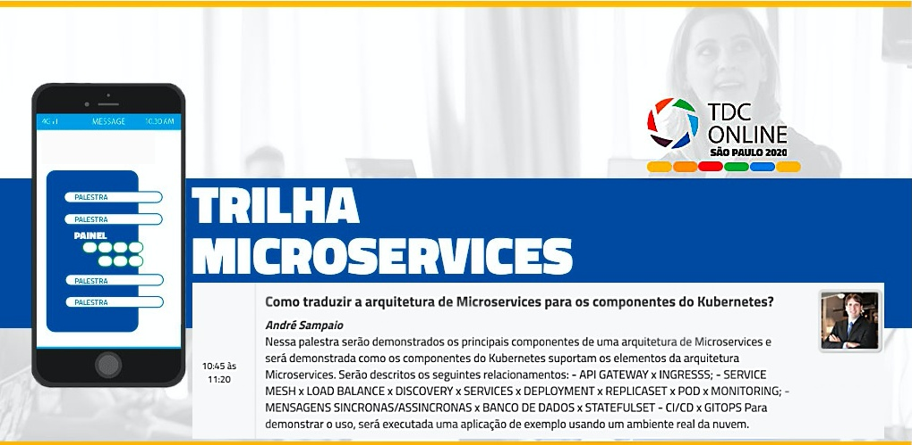

# demo-tdc

Trilha Microservices : Terça-feira, 25 de Agosto de 2020 das 10:45 às 11:20 no The Developers Conference

## **Como traduzir a arquitetura de Microservices para os componentes do Kubernetes?**

> `Nessa palestra serão demonstrados os principais componentes de uma arquitetura de Microservices e será demonstrada como os componentes do Kubernetes suportam os elementos da arquitetura Microservices. Serão descritos os seguintes relacionamentos: - API GATEWAY x INGRESSS; - SERVICE MESH x LOAD BALANCE x DISCOVERY x SERVICES x DEPLOYMENT x REPLICASET x POD x MONITORING; - MENSAGENS SINCRONAS/ASSINCRONAS x BANCO DE DADOS x STATEFULSET - CI/CD x GITOPS Para demonstrar o uso, será executada uma aplicação de exemplo usando um ambiente real da nuvem.`

Serviço demonstrado:  
[Sock Shop : A Microservice Demo Application](https://github.com/microservices-demo/microservices-demo/blob/master/deploy/kubernetes/complete-demo.yaml)

[Mais informações sobre as outras trilhas e valores](https://thedevconf.com/tdc/2020/sampaonline/trilha-microservices)
